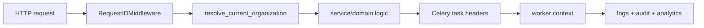

# Correlation ID

`RequestIDMiddleware` garantiza:

- `X-Request-ID` en request/response;
- `X-Correlation-ID` en request/response;
- reemplazo de headers invalidos;
- contexto disponible para logs, audit y Celery.

Flujo:

Los workers propagan el contexto con headers Celery bajo `observability_context`.
